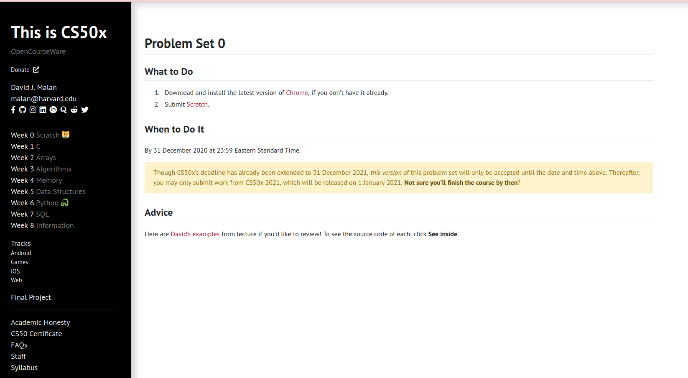
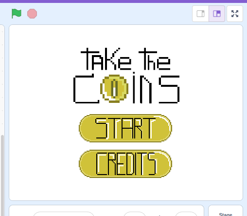
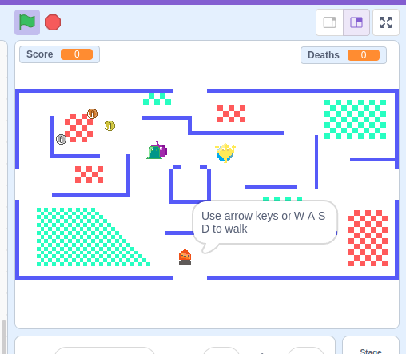
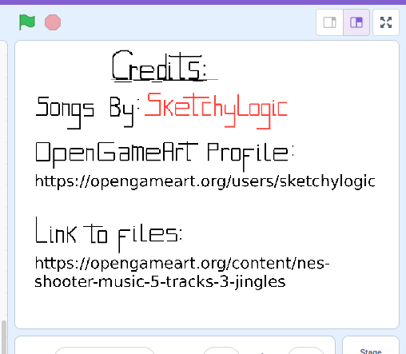
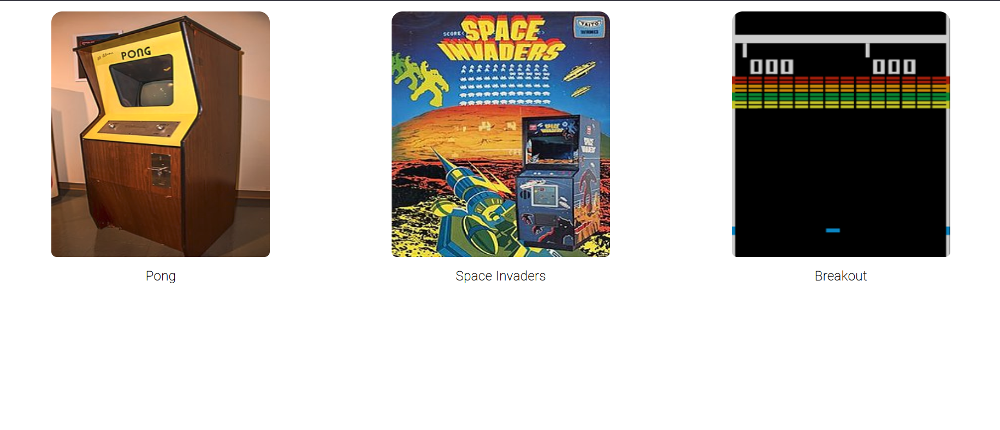
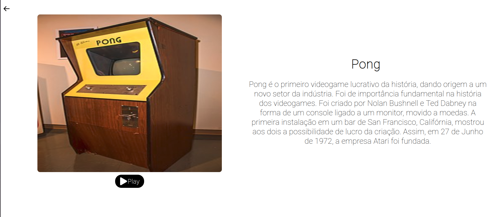
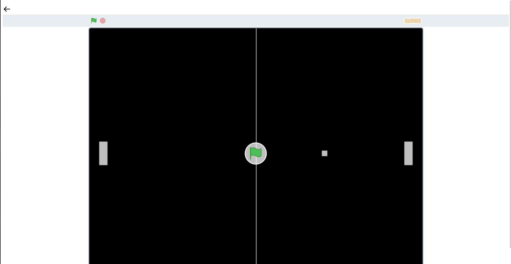
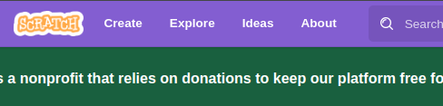
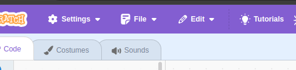
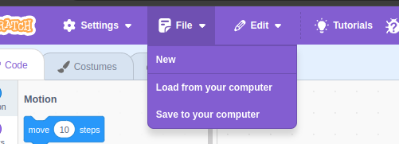

# My old Scratch Games

In 2020, during High School, I was exploring technology, as usual, doing whatever came to my mind, from a simple website to a game. For sure, I hadn't all the technological background I have today, so it's kinda embarrassing to see how many mistakes I did in my code, but it's also a nice piece of my history. Comparing the code I did at that time with my recent projects, it's obvious how much I've evolved.

At that time, I was doing CS50 and having some classes about some code related topics in school.

In CS50 during the first week (week 0), we had to build a game with scratch, exploring as much as we could the tool. And, believe or not, at school our teacher challenged us to build simple games in scratch too.

Some years passed and I'd forgotten these projects between my old backups. However, today (January 4th - 2025) I was organizing them and, surprisingly, I got across with some `.sb3` files (scratch format). So here I am with a big nostalgia and urged to explain you everything about these master pieces of technology.

## CS50 Project

[](https://cs50.harvard.edu/x/2020/psets/0/)

During Week 0 in CS50, You're introduced to computer science. [David J. Malan](https://cs.harvard.edu/malan/) starts presenting some basic logic, conditionals, loops and some Scratch specific things. 

After the class, you're challenged to create a game or interactive story to submit as a homework.

My solution for this problem set was a `Pacman` inspired game, which your goal is to get as much coins as you can without touching the monsters.

To make it different from `Pacman`, green areas were added to increase your speed and red areas to reduce it.





The game has as many bugs as Assassin's Creed Unity right after its release, but I've tried my best to beat Scratch.

All the sprites were done using [pixilart](https://www.pixilart.com/) and the sounds were taken from [sketchylogic](https://opengameart.org/users/sketchylogic) at [opengameart](https://opengameart.org/). You can find these files at [cs50-2020-pset0/](./cs50-2020-pset0/).

## School project

For school, my idea was creating a mini games cental in which the user could select any game he wanted to play and the game would appear right in front of him.

So, me and my group got simple versions of classical games (like pong) available at [scratch website](https://scratch.mit.edu/), then I did a simple website using `nodejs+react` and embedded these games on it.






Also, just to be fancy, I added a Wikipedia excerpt about each game, so after, selecting the game, some details appear explaining its history.


## How to Run?

First of all you need to clone this repo to your computer:

```bash
git clone https://github.com/Dpbm/scratch-old-games
```

Then:

### For Scratch

1. go to (scratch.mit.edu)[https://scratch.mit.edu/]
2. click on `create`



3. click on `file`



4. click on `Load from your computer`



5. Select the `.sb3` file to play


### For Games Central

To run Games Central website, you'll first need to install [nodejs](https://nodejs.org/en) and [yarn](https://yarnpkg.com) then:

```bash
# run backend
cd games_central/backend-end
npm i
npm run dev
```

after executing the backend, run:

```bash
# run frontend
cd games_central/front-end
npm i --legacy-peer-deps
npm run start
```

Now the backend is running at `http://localhost:3333` and frontend at `http://localhost:3000`.